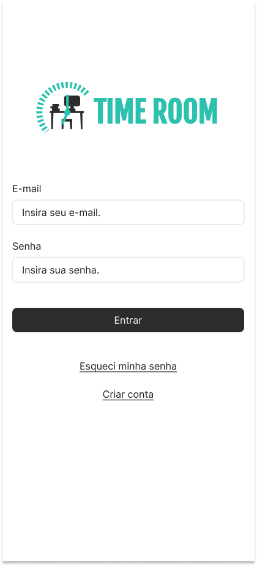
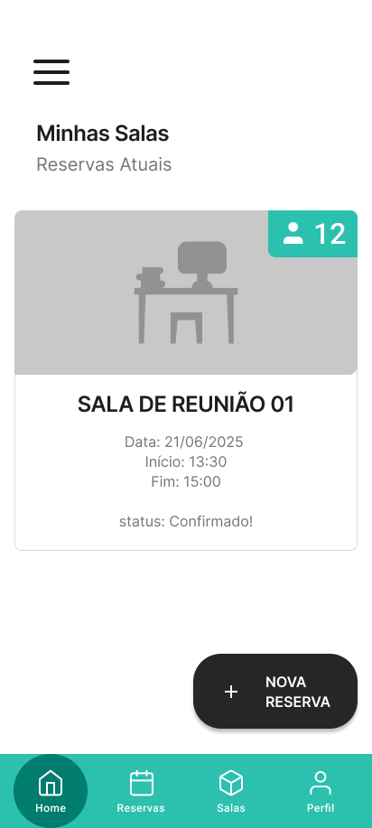

# ⏳ TimeRoom

**TimeRoom** é um aplicativo Flutter voltado para a **organização e agendamento de salas e eventos**. Ideal para equipes, escolas ou qualquer ambiente colaborativo onde o gerenciamento de tempo e espaço é essencial.

## 🚀 Funcionalidades

- 📅 Criar e agendar salas com data e horário
- 🕰️ Visualizar lista de salas criadas
- ✏️ Editar ou remover agendamentos
- 💡 Interface moderna com suporte a tema escuro
- 🔔 Notificações (em desenvolvimento)

## 📲 Tecnologias Utilizadas

- Flutter + Dart
- Provider (Gerenciamento de estado)
- SQLite / Firebase (dependendo da sua persistência)
- Material Design

## 📸 Screenshots
| Tela Login | Tela Home | Dashboard |
|------------|-----------|-----------|
|  |  |  |

## 🛠️ Como Rodar o Projeto

```bash
# 1. Clone o repositório
git clone https://github.com/seu-usuario/timeroom.git
cd timeroom

# 2. Instale as dependências
flutter pub get

# 3. Rode o projeto
flutter run
